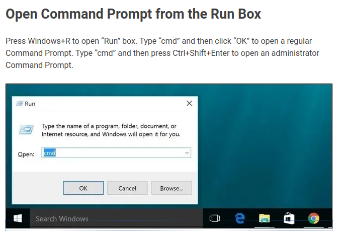

split will create a separate file of each page of a pdf. It only runs on the command line. 
## Linux:

### for executable:

 >./split *<file.pdf> newfilename:optional*
 
 ### for python script:
 
 You need the python pdf library.
 
>pip install pypdf2
 
 >python split.py *<file.pdf> newfilename:optional*'

 
 ## Windows 10
 
 ### for executable:
 
 open the command prompt:
 

 
 Navigate to the directory your pdf file and wsplit.exe is in. 
 
 >wsplit *<file.pdf> newfilename:optional*
 
  ### for python script:
  
 You need the python pdf library.
 
>pip install pypdf2
 
>python split.py *<file.pdf> newfilename:optional*'
 
 